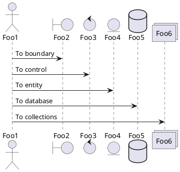

### Create virtual environment
- python3 -m venv supersocial

### Activate virtual environment
- cd supersocial/bin
- source activate
### plantuml examples
```puml
Alice -> Bob: Authentication Request
Bob --> Alice: Authentication Response

Alice -> Bob: Another authentication Request
Alice <-- Bob: Another authentication Response
@enduml
```

### Project Key Features
- Groups
- Multiple users and authentications
- Posts in a group similar to a tweet
- Linking user profiles with @ symbol
- Multiple Applications

### Starting Django project
- pip install django
- django-admin startproject supersocial
### Starting our first app named accounts

- cd supersocial
- python manage.py startapp accounts

### Templates and static files config inside settings.py

```djangourlpath
'DIRS': [os.path.join(BASE_DIR, 'templates')]
```
```djangourlpath
INSTALLED_APPS = [
    'django.contrib.admin',
    'django.contrib.auth',
    'django.contrib.contenttypes',
    'django.contrib.sessions',
    'django.contrib.messages',
    'django.contrib.staticfiles',
    'accounts',
]
```
```djangourlpath
STATIC_URL = '/static/'
STATICFILES_DIR = [os.path.join(BASE_DIR, 'static')]
```