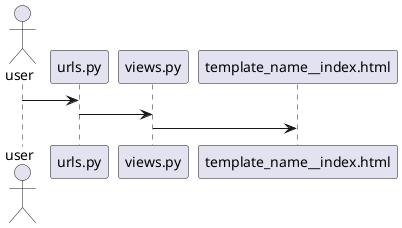
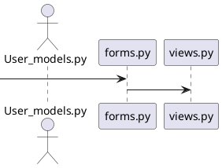

### Create virtual environment

- python3 -m venv supersocial

### Activate virtual environment

- cd supersocial/bin
- source activate in linux or activate in windows

### Initializing git

- git init
- git add -A
- git commit -m "my first commit"
- To set remote url: git remote add origin https://github.com/aashiqms/supersocial
    - To change remote url: git remote set-url origin https://github.com/aashiqms/supersocial
- git push origin master

### Project Key Features
- Groups
- Multiple users and authentications
- Posts in a group similar to a tweet
- Linking user profiles with @ symbol
- Multiple Applications

### Starting Django project

- pip install django
- django-admin startproject supersocial
### Starting our first app named accounts

- cd supersocial
- python manage.py startapp accounts

### Templates and static files config inside settings.py

```djangourlpath
'DIRS': [os.path.join(BASE_DIR, 'templates')]
```
```djangourlpath
INSTALLED_APPS = [
    'django.contrib.admin',
    'django.contrib.auth',
    'django.contrib.contenttypes',
    'django.contrib.sessions',
    'django.contrib.messages',
    'django.contrib.staticfiles',
    'accounts',
]
```
```djangourlpath
STATIC_URL = '/static/'
STATICFILES_DIR = [os.path.join(BASE_DIR, 'static')]
```

### Creating templates that we are always going to use in this website inside supersocial -> templates -> base.html, index.html

- base.html
```html
<!DOCTYPE html>
<html lang="en">
<head>
    <meta charset="UTF-8">
    <title>Title</title>
</head>
<body>



</body>
</html>
```
- index.html
```html
{#<!DOCTYPE html>#}


<h1>Welcome to super social</h1>


```

### Connecting TemplateView from views.py with index.html template

#### Template View

-  TemplateView extends the base class to make it also render a template.
- Renders a given template, with the context containing parameters captured in the URL.

##### Using TemplateView to display a template(index.html) inside views.py

- views.py
```python
from django.views.generic import TemplateView


class HomePage(TemplateView):
    template_name = 'index.html'


home_page_view = HomePage.as_view()

```
- urls.py

```python
from django.contrib import admin
from django.urls import path, include
from . views import home_page_view
app_name = 'accounts'
urlpatterns = [
    path('admin/', admin.site.urls),
    path('', view=home_page_view, name='home')
]

```


# Creating accounts Login/Logout functionality for our project

### models.py creating User Model

```python
from django.db import models
from django.contrib import auth


class User(auth.models.User, auth.models.PermissionsMixin):
    def __str__(self):
        return "@{}".format(self.username)
```
- We create a class called User that inherits from two classes User and PermissionsMixin from django.contrib.auth
- __str__ string representation of a object(here user)
- self.username here username is a attribute that comes builtin User Class of django.contrib.auth
 #### connecting forms.py for logging in or signing up with views.py
 #### Creating Form Sign Up forms.py
 ```python
class UserCreateForm(UserCreationForm):

    class Meta:
        fields = ('username', 'email', 'password1', 'password2')
        model = get_user_model()  # to get the current model of whoever accessing that website

    def __init__(self, *args, **kwargs):
        super().__init__(*args, **kwargs)
        self.fields['username'].label = 'Display Name'
        self.fields['email'].label = 'Email Address'
```
- When the user comes in and ready to sign up we call the UserCreationForm from django.contrib.auth.forms
- We set a meta Class to tell that these are the fields that should me made available to the user
- Then call superclass to customize the label of form fields(optional)

##### connecting views.py with forms.py
```python
from django.shortcuts import render
from django.urls import reverse_lazy
from django.views.generic import CreateView

from . import forms


class SignUp(CreateView):
    form_class = forms.UserCreateForm
    success_url = reverse_lazy('login')
    template_name = 'accounts/signup.html'
```
- Create a class called SignUp that inherits from CreateView
- Assign form_class with the UserCreateForm class we created inside forms.py
- Assign template_name to signup.html
- success_url = reverse_lazy('login') is used to redirect the user to login page after successful signup it is called reverse_lazy since the redirect happens only after user successfully clicks the signup button
### Creating templates folder inside accounts app
- Creating directories and html files for login and signup as mentioned in forms.py
- accounts -> templates -> accounts -> signup.html
- accounts -> templates -> registration -> login.html
 

### Creating login.html and signup.html as mentioned in forms.py

- signup.html
```html



<div class="flex-container">
    <h1>Sign UP Here</h1>

    
    <input type="submit" value="Sign Up" class="btn btn-success">
</div>

```
- login.html
```html



<div class="flex-container">
    <h1>Login Here</h1>

    
    <input type="submit" value="Login" class="btn btn-success">
</div>

```
### Setting up views.py and urls.py and the connection between them

- create accounts -> urls.py
- accounts/urls.py
```python
from django.contrib.auth.views import LoginView, LogoutView
from django.urls import path
from .views import SignUp

app_name = 'accounts'
login_view = LoginView.as_view(template_name='accounts/accounts/templates/registration/login.html')
logout_view = LogoutView.as_view()
sign_up_view = SignUp.as_view()


urlpatterns = [
    path('login/', view=login_view, name='login'),
    path('logout/', view=login_view, name='logout'),
    path('signup/', view=sign_up_view, name='signup')
]
```
- django.contrib.auth import views as auth_views provides Login View and Logout View in earlier versions of django we need to create these views inside views.py similar to how we created SignUp(CreateView)
- we'll call this app name accounts that way in case I ever want to use your old templates in my base or each time I'll file for example at the navigation bar I can refer to it as the accounts application and then we'll set up our world patterns list.
- For the LoginView we will provide the template we created login.html login_view = LoginView.as_view(template_name='accounts/login.html')
- LogoutView will redirect to homepage by default
- For SignUpView we will use the SignUp View we created inside views.py

### Connect our accounts application to full project using views and urls

- supersocial -> urls.py
```python
from django.contrib import admin
from django.urls import path, include
from . views import home_page_view


urlpatterns = [
    path('admin/', admin.site.urls),
    path('', view=home_page_view, name='home'),
    path('accounts/', include('accounts.urls', namespace='accounts')),
    path('accounts/', include('django.contrib.auth.urls', namespace='accounts'))

]
```
- Connecting the accounts mainspace to accounts -> urls.py
-  Tells when someone has logged in connect to urls.py inside the app folder
- the below line is used to connect djangos built in authorization models with our project
- path('accounts/', include('django.contrib.auth.urls', namespace='accounts'))
- we dont need to register out authorization models inside admin.py since it is djangos builtin models
### Editing base.html to look good and have navigation bar with signup and other links

- home button in navigation bar with site name
```html
 <a class="navbar-brand mynav" href="">Super Social</a>
```
-  is the name given for homepage inside urls.py

- Checking if the user is logged in to vary the links provide in navigation bar
```html

                      <li><a href="" class="btn btn-simple">Post</a></li>
                      <li><a href="" class="btn btn-simple">Groups</a></li>
                      <li><a href="" class="btn btn-simple">Create Group</a></li>
                      <li><a href="" class="btn btn-simple">Log out</a></li>
    						
    						      <li><a href=""class="btn btn-simple">Groups</a></li>
    						      <li><a href="" class="btn btn-simple">Log in</a></li>
    						      <li><a href="" class="btn btn-simple">Sign up</a></li>
    						
```


 - the line  href="" class="btn btn-simple">Log out is used to provide logout option if the user is logged in we use the logout as we the provided apps_name and view name in urls.py
 
### Adding Login redirect and Logout redirect url inside settings.py
 
### settings.py LOGIN_REDIRECT_URL AND LOGOUT_REDIRECT_URL
 ```python
LOGIN_REDIRECT_URL = 'test'
LOGOUT_REDIRECT_URL = 'thanks'
```
- create thanks.html and test.html inside templates folder present in the main directory
- create the TestView and ThanksView inside views.py of the accounts app
- route the views inside urls.py
- views.py
```python
from django.views.generic import TemplateView


class HomePage(TemplateView):
    template_name = 'index.html'


class TestPage(TemplateView):
    template_name = 'index.html'


class ThanksPage(TemplateView):
    template_name = 'index.html'


home_page_view = HomePage.as_view()
test_page_view = TestPage.as_view()
thanks_page_view = ThanksPage.as_view()
```

- urls.py
```python
from django.contrib import admin
from django.urls import path, include
from . views import home_page_view, test_page_view, thanks_page_view

app_name = 'accounts'
urlpatterns = [
    path('admin/', admin.site.urls),
    path('', view=home_page_view, name='home'),
    path('accounts', include('accounts.urls')),
    path('accounts/', include('django.contrib.auth.urls')),
    path('test/', view=test_page_view, name='test'),
    path('thanks/', view=thanks_page_view, name='thanks'),
]


```

- thanks.html
```html


    <h1>thanks for visiting comeback soon</h1>

```
- test.html
```html


    <h1>You have logged in successfully</h1>

```
### Make migrations

- python manage.py makemigrations
- python manage.py migrate

### Runserver and check if everything is working

- python manage.py runserver
- visit localhost:8000

### Accounts app flow diagram


# Groups and Posts applications

- Now we will begin setting up views, urls and templates for the groups and posts applications.
- Given that they are interconnected we have to work with them concurrently.
- Lets start by setting up the files.

### startapp groups and posts

- python manage.py startapp posts
- python manage.py startapp groups

### creating templates folder/files inside groups and posts

- posts -> templates -> posts -> _post.html, post_base.html, post_confirm_delete.html, post_delete.html, post_form.html, post_list.html, user_post_list.html
- groups -> templates -> groups -> group_base.html, group_detail, group_form.html, group_list.html

#### building models.py for groups and posts applications

### Creating models for groups app

- models.py

### Install misaka:

import masaka allows us to user links or markdown texts in comments

- To install misaka following dependencies must be satisfied
- Secure Sockets Layer toolkit - development files
    - This package is part of the OpenSSL project's implementation of the SSL and TLS cryptographic protocols for secure communication over the Internet. It contains development libraries, header files, and manpages for libssl and libcrypto. 

```commandline
sudo apt-get install build-essential libssl-dev libffi-dev python3-dev
```
- Install gcc
```commandline
pip install gcc7
```

- Now Install misaka with the following command
```commandline
pip install misaka
```
### Import Slugify

- slugify allows us to remove characters that are alphanumeric, that is if we want to use urls with space it will automatically fill spaces with underscores and lower letter character after that.
- from django.utils.text import slugify

### on_delete=models.CASCADE

- CASCADE: When the referenced object is deleted, also delete the objects that have references to it (When you remove a blog post for instance, you might want to delete comments as well). SQL equivalent: CASCADE.

### models.py groups

```python
from django.db import models
from django import template
from django.contrib.auth import get_user_model
from django.urls import reverse
from django.utils.text import slugify

import misaka


User = get_user_model()


register = template.Library()  # custom template tag


class Group(models.Model):
    name = models.CharField(max_length=256, unique=True)
    slug = models.SlugField(allow_unicode=True, unique=True)
    description = models.TextField(max_length=500, blank=True, default='')
    description_html = models.TextField(editable=False, default='', blank=True)
    members = models.ManyToManyField(User, through='GroupMember')

    def __str__(self):
        return self.name

    def save(self, *args, **kwargs):
        self.slug = slugify(self.name)
        self.description_html = misaka.html(self.description)
        super().save(*args, **kwargs)

    def get_absolute_url(self):
        return reverse('groups:single', kwargs={'slug': self.slug})

    class Meta:
        ordering = ['name']


class GroupMember(models.Model):
    group = models.ForeignKey(Group, related_name='memberships', on_delete=models.CASCADE)
    user = models.ForeignKey(User, related_name='user_groups', on_delete=models.CASCADE)

    def __str__(self):
        return self.user.username

    class Meta:
        unique_together = ('group', 'user')


```
**code explanation**
- User = get_user_model() returns user model from Django's default User model for current user, allows us to call things from current user's session
- register = template.Library()  # custom template tag will be explained later
- Create a new class named Group which inherits from Model class(base class) present inside of models module
    - **module:** _A module is a file containing Python definitions and statements. The file name is the module name with the suffix .py appended. Within a module, the module’s name (as a string) is available as the value of the global variable  ```__name___```

- **slug**  
```python
slug = models.SlugField(allow_unicode=True, unique=True)
```
# Slug Definition
# example of slugify in samples

- A "slug" is a way of generating a valid URL, generally using data already obtained. For instance, a slug uses the title of an article to generate a URL. I advise to generate the slug by means of a function, given the title (or another piece of data), rather than setting it manually.
- sample example:
```html
<title> new website page </title>
<p> A silly comedy movie </p>
<slug> new-website-page </slug>
```
sample models.py
```python
class Article(models.Model):
    title = models.CharField(max_length=100)
    content = models.TextField(max_length=1000)
    slug = models.SlugField(max_length=40)
```
- How would you reference this object with a URL and with a meaningful name? You could for instance use Article.id so the URL would look like this:
```html
www.example.com/article/23
```
- Or, you might want to reference the title like this,:
```html
www.example.com/article/new website page
``` 
- since spaces are not valid in url they are replaced by %20
```html
www.example.com/article/new%20website%20page
```
- Both attempts are not resulting in very meaningful, easy-to-read URL. This is better:
```html
www.example.com/article/new-website-page
```
# slugify
```python
class Article(models.Model):
    title = models.CharField(max_length=100)
    slug = models.SlugField(max_length=100, unique=True)
```
- If slug url needs to be unique add unique=True
- sample models.py using slugify
```python
from django.template.defaultfilters import slugify

class Article(models.Model):
    title = models.CharField(max_length=100)

    def slug(self):
        return slugify(self.title)
```
# slugify usage in this project
```python
class Group(models.Model):
    name = models.CharField(max_length=256, unique=True)
    slug = models.SlugField(allow_unicode=True, unique=True)
    description = models.TextField(max_length=500, blank=True, default='')
    description_html = models.TextField(editable=False, default='', blank=True)
    members = models.ManyToManyField(User, through='GroupMember')
```
```python
    def save(self, *args, **kwargs):
        self.slug = slugify(self.name)
        self.description_html = misaka.html(self.description)
        super().save(*args, **kwargs)

    def get_absolute_url(self):
        return reverse('groups:single', kwargs={'slug': self.slug})
```
1. Defining slug Field slug = models.SlugField(allow_unicode=True, unique=True) and giving it unique parameter
2. allow_unicode=True parameter allows unicode charcter in slug in addition to ASCII characters.
3. Using name to provide url words for slugiy self.slug = slugify(self.name)
4. getting absolute url of the current slug return reverse('groups:single', kwargs={'slug': self.slug})
# get_absolute_url()
- First of all, when it comes to web development you really want to avoid hard coding paths in your templates. The reason for this is that paths might change, and it will be a hassle to go through all your HTML and templates to find every single URL or path and update it manually. It makes your code much harder to maintain.

- The solution to this is to define functions that return the URL instead. This is where get_absolute_url() comes into the picture.
```html
<!-- Bad -->
<a href="/language/category/product/{{product.pk}}">Link</a>

```
- good example models.py
```python
class Products(models.Model):
    title = models.CharField(max_length=120)
    slug = models.SlugField(blank=True, unique=True)
    description = models.TextField()

    def get_absolute_url(self):
        return f"/products/{self.slug}/"
```
- example.html
```html

   <a href="{{obj.get_absolute_url}} ">{{obj.title}}</a> <br>

```
- example urls.py
```djangourlpath
 path('/products/<slug>/', view=product_detail_view),
```

- Defining members Foreign key inside Group model that interacts with User model
```python
members = models.ManyToManyField(User, through='GroupMember')
```
# ForeignKey
- A many-to-one relationship. Requires two **positional arguments**: the class to which the model is related and the on_delete option.
    - **Positional arguments** are arguments that need to be included in the proper position or order. The first positional argument always needs to be listed first when the function is called.

- To create a recursive relationship – an object that has a many-to-one relationship with itself – use models.ForeignKey('self', on_delete=models.CASCADE).

- If you need to create a relationship on a model that has not yet been defined, you can use the name of the model, rather than the model object itself:

# ManyToManyField through_fields
- Only used when a custom intermediary model is specified. Django will normally determine which fields of the intermediary model to use in order to establish a many-to-many relationship automatically. However, consider the following models:
- models.py example for through_fields
```python
from django.db import models

class Person(models.Model):
    name = models.CharField(max_length=50)

class Group(models.Model):
    name = models.CharField(max_length=128)
    members = models.ManyToManyField(
        Person,
        through='Membership',
        through_fields=('group', 'person'),
    )

class Membership(models.Model):
    group = models.ForeignKey(Group, on_delete=models.CASCADE)
    person = models.ForeignKey(Person, on_delete=models.CASCADE)
    inviter = models.ForeignKey(
        Person,
        on_delete=models.CASCADE,
        related_name="membership_invites",
    )
    invite_reason = models.CharField(max_length=64)
```
- Membership has two foreign keys to Person (person and inviter), which makes the relationship ambiguous and Django can’t know which one to use. In this case, you must explicitly specify which foreign keys Django should use using through_fields, as in the example above.

- through_fields accepts a 2-tuple ('field1', 'field2'), where field1 is the name of the foreign key to the model the ManyToManyField is defined on (group in this case), and field2 the name of the foreign key to the target model (person in this case).

- When you have more than one foreign key on an intermediary model to any (or even both) of the models participating in a many-to-many relationship, you must specify through_fields. This also applies to recursive relationships when an intermediary model is used and there are more than two foreign keys to the model, or you want to explicitly specify which two Django should use.
```python
from django.db import models

class Car(models.Model):
    manufacturer = models.ForeignKey(
        'Manufacturer',
        on_delete=models.CASCADE,
    )
    # ...

class Manufacturer(models.Model):
    # ...
    pass
```
https://docs.djangoproject.com/en/3.0/ref/models/fields/#django.db.models.ForeignKey
# Databases
.jpg?raw=true)
.jpg?raw=true)
.jpg?raw=true)
.jpg?raw=true)

# Groups App

- User = get_user_model()
    - User objects have the following fields:

username

    Required. 30 characters or fewer. Usernames may contain alphanumeric, _, @, +, . and - characters.

first_name

    Optional. 30 characters or fewer.

last_name

    Optional. 30 characters or fewer.

email

    Optional. Email address.

password

    Required. A hash of, and metadata about, the password. (Django doesn’t store the raw password.) Raw passwords can be arbitrarily long and can contain any character. See the password documentation.

groups

    Many-to-many relationship to Group

user_permissions

    Many-to-many relationship to Permission

is_staff

    Boolean. Designates whether this user can access the admin site.

is_active

    Boolean. Designates whether this user account should be considered active. We recommend that you set this flag to False instead of deleting accounts; that way, if your applications have any foreign keys to users, the foreign keys won’t break.

    This doesn’t necessarily control whether or not the user can log in. Authentication backends aren’t required to check for the is_active flag, and the default backends do not. If you want to reject a login based on is_active being False, it’s up to you to check that in your own login view or a custom authentication backend. However, the AuthenticationForm used by the login() view (which is the default) does perform this check, as do the permission-checking methods such as has_perm() and the authentication in the Django admin. All of those functions/methods will return False for inactive users.

is_superuser

    Boolean. Designates that this user has all permissions without explicitly assigning them.

last_login

    A datetime of the user’s last login.
    Changed in Django 1.8:

    This field will be null if the user has never logged in. Previously it was set to the current date/time by default.

date_joined

    A datetime designating when the account was created. Is set to the current date/time by default when the account is created.
