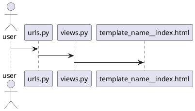
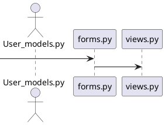

### Create virtual environment

- python3 -m venv supersocial

### Activate virtual environment

- cd supersocial/bin
- source activate in linux or activate in windows

### Initializing git

- git init
- git add -A
- git commit -m "my first commit"
- To set remote url: git remote add origin https://github.com/aashiqms/supersocial
    - To change remote url: git remote set-url origin https://github.com/aashiqms/supersocial
- git push origin master

### Project Key Features
- Groups
- Multiple users and authentications
- Posts in a group similar to a tweet
- Linking user profiles with @ symbol
- Multiple Applications

### Starting Django project

- pip install django
- django-admin startproject supersocial
### Starting our first app named accounts

- cd supersocial
- python manage.py startapp accounts

### Templates and static files config inside settings.py

```djangourlpath
'DIRS': [os.path.join(BASE_DIR, 'templates')]
```
```djangourlpath
INSTALLED_APPS = [
    'django.contrib.admin',
    'django.contrib.auth',
    'django.contrib.contenttypes',
    'django.contrib.sessions',
    'django.contrib.messages',
    'django.contrib.staticfiles',
    'accounts',
]
```
```djangourlpath
STATIC_URL = '/static/'
STATICFILES_DIR = [os.path.join(BASE_DIR, 'static')]
```

### Creating templates that we are always going to use in this website inside supersocial -> templates -> base.html, index.html

- base.html
```html
<!DOCTYPE html>
<html lang="en">
<head>
    <meta charset="UTF-8">
    <title>Title</title>
</head>
<body>



</body>
</html>
```
- index.html
```html
{#<!DOCTYPE html>#}


<h1>Welcome to super social</h1>


```

### Connecting TemplateView from views.py with index.html template

#### Template View

-  TemplateView extends the base class to make it also render a template.
- Renders a given template, with the context containing parameters captured in the URL.

##### Using TemplateView to display a template(index.html) inside views.py

- views.py
```python
from django.views.generic import TemplateView


class HomePage(TemplateView):
    template_name = 'index.html'


home_page_view = HomePage.as_view()

```
- urls.py

```python
from django.contrib import admin
from django.urls import path, include
from . views import home_page_view
app_name = 'accounts'
urlpatterns = [
    path('admin/', admin.site.urls),
    path('', view=home_page_view, name='home')
]

```


# Creating accounts Login/Logout functionality for our project

### models.py creating User Model

```python
from django.db import models
from django.contrib import auth


class User(auth.models.User, auth.models.PermissionsMixin):
    def __str__(self):
        return "@{}".format(self.username)
```
- We create a class called User that inherits from two classes User and PermissionsMixin from django.contrib.auth
- __str__ string representation of a object(here user)
- self.username here username is a attribute that comes builtin User Class of django.contrib.auth
 #### connecting forms.py for logging in or signing up with views.py
 #### Creating Form Sign Up forms.py
 ```python
class UserCreateForm(UserCreationForm):

    class Meta:
        fields = ('username', 'email', 'password1', 'password2')
        model = get_user_model()  # to get the current model of whoever accessing that website

    def __init__(self, *args, **kwargs):
        super().__init__(*args, **kwargs)
        self.fields['username'].label = 'Display Name'
        self.fields['email'].label = 'Email Address'
```
- When the user comes in and ready to sign up we call the UserCreationForm from django.contrib.auth.forms
- We set a meta Class to tell that these are the fields that should me made available to the user
- Then call superclass to customize the label of form fields(optional)

##### connecting views.py with forms.py
```python
from django.shortcuts import render
from django.urls import reverse_lazy
from django.views.generic import CreateView

from . import forms


class SignUp(CreateView):
    form_class = forms.UserCreateForm
    success_url = reverse_lazy('login')
    template_name = 'accounts/signup.html'
```
- Create a class called SignUp that inherits from CreateView
- Assign form_class with the UserCreateForm class we created inside forms.py
- Assign template_name to signup.html
- success_url = reverse_lazy('login') is used to redirect the user to login page after successful signup it is called reverse_lazy since the redirect happens only after user successfully clicks the signup button
### Creating templates folder inside accounts app
- Creating directories and html files for login and signup as mentioned in forms.py
- accounts -> templates -> accounts -> signup.html
- accounts -> templates -> registration -> login.html
 

### Creating login.html and signup.html as mentioned in forms.py

- signup.html
```html



<div class="flex-container">
    <h1>Sign UP Here</h1>

    
    <input type="submit" value="Sign Up" class="btn btn-success">
</div>

```
- login.html
```html



<div class="flex-container">
    <h1>Login Here</h1>

    
    <input type="submit" value="Login" class="btn btn-success">
</div>

```
### Setting up views.py and urls.py and the connection between them

- create accounts -> urls.py
- accounts/urls.py
```python
from django.contrib.auth.views import LoginView, LogoutView
from django.urls import path
from .views import SignUp

app_name = 'accounts'
login_view = LoginView.as_view(template_name='accounts/accounts/templates/registration/login.html')
logout_view = LogoutView.as_view()
sign_up_view = SignUp.as_view()


urlpatterns = [
    path('login/', view=login_view, name='login'),
    path('logout/', view=login_view, name='logout'),
    path('signup/', view=sign_up_view, name='signup')
]
```
- django.contrib.auth import views as auth_views provides Login View and Logout View in earlier versions of django we need to create these views inside views.py similar to how we created SignUp(CreateView)
- we'll call this app name accounts that way in case I ever want to use your old templates in my base or each time I'll file for example at the navigation bar I can refer to it as the accounts application and then we'll set up our world patterns list.
- For the LoginView we will provide the template we created login.html login_view = LoginView.as_view(template_name='accounts/login.html')
- LogoutView will redirect to homepage by default
- For SignUpView we will use the SignUp View we created inside views.py

### Connect our accounts application to full project using views and urls

- supersocial -> urls.py
```python
from django.contrib import admin
from django.urls import path, include
from . views import home_page_view


urlpatterns = [
    path('admin/', admin.site.urls),
    path('', view=home_page_view, name='home'),
    path('accounts/', include('accounts.urls', namespace='accounts')),
    path('accounts/', include('django.contrib.auth.urls', namespace='accounts'))

]
```
- Connecting the accounts mainspace to accounts -> urls.py
-  Tells when someone has logged in connect to urls.py inside the app folder
- the below line is used to connect djangos built in authorization models with our project
- path('accounts/', include('django.contrib.auth.urls', namespace='accounts'))
- we dont need to register out authorization models inside admin.py since it is djangos builtin models
### Editing base.html to look good and have navigation bar with signup and other links

- home button in navigation bar with site name
```html
 <a class="navbar-brand mynav" href="">Super Social</a>
```
-  is the name given for homepage inside urls.py

- Checking if the user is logged in to vary the links provide in navigation bar
```html

                      <li><a href="" class="btn btn-simple">Post</a></li>
                      <li><a href="" class="btn btn-simple">Groups</a></li>
                      <li><a href="" class="btn btn-simple">Create Group</a></li>
                      <li><a href="" class="btn btn-simple">Log out</a></li>
    						
    						      <li><a href=""class="btn btn-simple">Groups</a></li>
    						      <li><a href="" class="btn btn-simple">Log in</a></li>
    						      <li><a href="" class="btn btn-simple">Sign up</a></li>
    						
```


 - the line  href="" class="btn btn-simple">Log out is used to provide logout option if the user is logged in we use the logout as we the provided apps_name and view name in urls.py
 
### Adding Login redirect and Logout redirect url inside settings.py
 
### settings.py LOGIN_REDIRECT_URL AND LOGOUT_REDIRECT_URL
 ```python
LOGIN_REDIRECT_URL = 'test'
LOGOUT_REDIRECT_URL = 'thanks'
```
- create thanks.html and test.html inside templates folder present in the main directory
- create the TestView and ThanksView inside views.py of the accounts app
- route the views inside urls.py
- views.py
```python
from django.views.generic import TemplateView


class HomePage(TemplateView):
    template_name = 'index.html'


class TestPage(TemplateView):
    template_name = 'index.html'


class ThanksPage(TemplateView):
    template_name = 'index.html'


home_page_view = HomePage.as_view()
test_page_view = TestPage.as_view()
thanks_page_view = ThanksPage.as_view()
```

- urls.py
```python
from django.contrib import admin
from django.urls import path, include
from . views import home_page_view, test_page_view, thanks_page_view

app_name = 'accounts'
urlpatterns = [
    path('admin/', admin.site.urls),
    path('', view=home_page_view, name='home'),
    path('accounts', include('accounts.urls')),
    path('accounts/', include('django.contrib.auth.urls')),
    path('test/', view=test_page_view, name='test'),
    path('thanks/', view=thanks_page_view, name='thanks'),
]


```

- thanks.html
```html


    <h1>thanks for visiting comeback soon</h1>

```
- test.html
```html


    <h1>You have logged in successfully</h1>

```
### Make migrations

- python manage.py makemigrations
- python manage.py migrate

### Runserver and check if everything is working

- python manage.py runserver
- visit localhost:8000

# Groups and Posts applications

- Now we will begin setting up views, urls and templates for the groups and posts applications.
- Given that they are interconnected we have to work with them concurrently.
- Lets start by setting up the files.

### startapp groups and posts

- python manage.py startapp posts
- python manage.py startapp groups

### creating templates folder/files inside groups and posts

- posts -> templates -> posts -> _post.html, post_base.html, post_confirm_delete.html, post_delete.html, post_form.html, post_list.html, user_post_list.html
- groups -> templates -> groups -> group_base.html, group_detail, group_form.html, group_list.html

